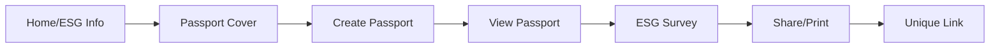

# 🚀 Carbon Passport 기술 스택 및 아키텍처 계획

## 📋 기술 스택 (Tech Stack)

### Frontend

- **Framework**: Next.js 14 (App Router)
  - Server Components for ESG information pages
  - Client Components for interactive features
  - Built-in routing for multi-page flow
  - Image optimization for photo uploads

- **UI Components**: shadcn/ui
  - Modern, accessible components
  - Tailwind CSS for styling
  - Radix UI primitives
  - Dark mode support (future)

- **State Management**:
  - Zustand for client-side state (route selection, form data)
  - React Query (TanStack Query) for server state

- **Map**:
  - React-Leaflet for interactive maps
  - Custom curved route rendering
- **Additional Libraries**:
  - react-hook-form + zod (form validation)
  - react-to-print (passport printing)
  - react-barcode or custom SVG (barcode generation)
  - next-intl (i18n for 4 countries)
  - framer-motion (smooth page transitions)
  - react-dropzone (photo upload)

### Backend

- **Database & Auth**: Supabase
  - PostgreSQL for data persistence
  - Row Level Security (RLS) for data protection
  - Real-time subscriptions (future: live updates)
  - Storage bucket for photo uploads
  - Built-in auth (if needed later)

- **API**: Next.js API Routes
  - `/api/passport` - Create/retrieve passports
  - `/api/survey` - Submit survey responses
  - `/api/share` - Generate shareable links
  - `/api/stations` - Station data & routes

### Deployment

- **Hosting**: Vercel
  - Edge Functions for API routes
  - Automatic CI/CD from GitHub
  - Preview deployments
  - Analytics & Web Vitals

## 🏗️ Architecture

### Database Schema (Supabase)

```sql
-- Tables
passports (
  id uuid PRIMARY KEY,
  traveler_name text,
  country varchar(2),
  photo_url text,
  travel_date date,
  created_at timestamp,
  share_hash varchar(32),
  expires_at timestamp
)

routes (
  id uuid PRIMARY KEY,
  passport_id uuid REFERENCES passports,
  start_station varchar(20),
  end_station varchar(20),
  distance integer,
  co2_saved decimal
)

survey_responses (
  id uuid PRIMARY KEY,
  passport_id uuid REFERENCES passports,
  responses jsonb,
  completed_at timestamp
)

stations (
  code varchar(20) PRIMARY KEY,
  name_ko text,
  name_en text,
  latitude decimal,
  longitude decimal
)
```

### Project Structure

```
carbon-passport/
├── app/
│   ├── [locale]/
│   │   ├── page.tsx                 // Home (ESG info)
│   │   ├── passport/
│   │   │   ├── cover/page.tsx       // Passport cover
│   │   │   ├── create/page.tsx      // Create passport
│   │   │   ├── view/page.tsx        // View passport
│   │   │   └── [id]/page.tsx        // Shared passport
│   │   ├── survey/page.tsx          // ESG survey
│   │   └── share/page.tsx           // Share & print
│   ├── api/
│   │   ├── passport/route.ts
│   │   ├── survey/route.ts
│   │   └── share/route.ts
│   └── layout.tsx
├── components/
│   ├── ui/                          // shadcn components
│   ├── passport/
│   │   ├── PhotoUpload.tsx
│   │   ├── RouteSelector.tsx
│   │   ├── RouteMap.tsx
│   │   ├── PassportDocument.tsx
│   │   └── Barcode.tsx
│   └── survey/
│       └── ESGQuestions.tsx
├── lib/
│   ├── supabase/
│   │   ├── client.ts
│   │   └── server.ts
│   ├── utils/
│   │   ├── co2-calculator.ts
│   │   └── haversine.ts
│   └── constants/
│       └── stations.ts
├── hooks/
│   ├── usePassport.ts
│   └── useSurvey.ts
├── locales/
│   ├── ko/
│   ├── en/
│   ├── ja/
│   └── zh/
└── styles/
    └── globals.css
```

## 🔄 User Flow Architecture



## 💡 Key Technical Decisions

### 1. Next.js App Router 선택 이유

- Server Components로 ESG 정보 페이지 최적화
- Built-in i18n routing (`/ko`, `/en`, `/ja`, `/zh`)
- API Routes로 백엔드 로직 통합
- Image optimization for photos
- Vercel과 완벽한 통합

### 2. Supabase 선택 이유

- PostgreSQL 기반 (안정적)
- Real-time 기능 (향후 확장)
- Storage bucket (사진 업로드)
- Row Level Security
- 무료 tier로 충분 (하루 10명)

### 3. shadcn/ui 선택 이유

- 최신 디자인 트렌드
- Fully customizable
- Accessibility 내장
- TypeScript 지원
- Radix UI 기반

### 4. 성능 최적화 전략

- Photo compression before upload
- Lazy loading for map components
- Static generation for ESG pages
- Edge caching for API responses

## 🚦 구현 우선순위

### Phase 1: Core Features (Week 1)

1. Next.js + shadcn/ui 프로젝트 설정
2. Supabase 연동 및 스키마 생성
3. 여권 생성 페이지 (사진 업로드, 경로 선택)
4. 여권 보기 페이지 (지도, CO2 비교)

### Phase 2: Survey & Sharing (Week 2)

5. ESG 설문조사 구현
6. 공유 링크 생성 및 만료 로직
7. 인쇄 기능 최적화

### Phase 3: Polish & i18n (Week 3)

8. 4개국어 지원 (한/영/일/중)
9. 국기 표시 (flagsapi.com)
10. ESG 홈페이지 컨텐츠
11. 애니메이션 및 전환 효과

## 🔧 개발 환경 설정

```bash
# 프로젝트 생성
npx create-next-app@latest carbon-passport --typescript --tailwind --app

# 필수 패키지 설치
npm install @supabase/supabase-js @supabase/ssr
npm install @tanstack/react-query zustand
npm install react-leaflet leaflet
npm install react-hook-form zod @hookform/resolvers
npm install framer-motion react-dropzone
npm install next-intl

# shadcn/ui 설정
npx shadcn@latest init
npx shadcn@latest add button card form input select dialog toast
```

## 📝 환경 변수 (.env.local)

```
NEXT_PUBLIC_SUPABASE_URL=your_supabase_url
NEXT_PUBLIC_SUPABASE_ANON_KEY=your_anon_key
NEXT_PUBLIC_BASE_URL=https://your-domain.vercel.app
```

## 🎯 MVP 범위

### 반드시 구현해야 할 기능

1. 여행자 정보 입력 (이름, 국가, 사진)
2. 경로 선택 및 CO2 계산
3. 여권 생성 및 표시
4. ESG 설문조사 (6문항)
5. 인쇄 기능
6. 공유 링크 생성 (30일 유효)

### 향후 추가 기능

- 사용자 인증 시스템
- 여권 수정 기능
- 통계 대시보드
- 더 많은 역 추가
- SNS 공유 기능
